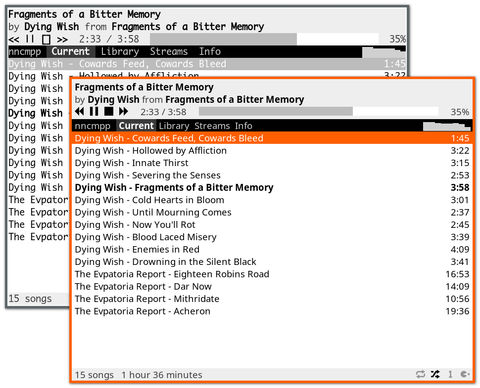

pk's nncmpp fork
================
This is a varient of the nncmpp editor built to my
liking. You'll probably hate it, but I like it. 

Here's my settings, if you're curious:

....
colors = {
	normal = ""
	highlight = "bold"
	elapsed = "reverse"
	remains = ""

	tab_bar = "reverse"
	tab_active = "reverse bold"
	defocused   = ""

	selection = "reverse"
	multiselect = "reverse"
}

normal = {
       "Right" = "mpd-volume-up"
       "Left" = "mpd-volume-down"
}
....

 This is not for you.

nncmpp
======

'nncmpp' is yet another MPD client.  Its specialty is running equally well in
the terminal, or as an X11 client--it will provide the same keyboard- and
mouse-friendly interface.

This project began its life as a simplified TUI version of Sonata.  I had
already written a lot of the required code before, so I had the perfect
opportunity to get rid of the unmaintained Python application, and to make
the first TUI client that doesn't feel awkward to use.

If it's not obvious enough, the name is a pun on all those ridiculous client
names, and should be pronounced as "nincompoop".

Features
--------
Most stuff is there.  I've been using the program exclusively for many years.
Among other things, it can display and change PulseAudio volume directly
to cover the use case of remote control, it has a fast spectrum visualiser,
it can be extended with plugins to fetch lyrics or other song-related info,
and both its appearance and key bindings can be customized.

Note that currently only the filesystem browsing mode is implemented,
and the search feature is known to be clumsy.

Packages
--------
Regular releases are sporadic.  git master should be stable enough.  You can get
a package with the latest development version from Archlinux's AUR.

Documentation
-------------
See the link:nncmpp.adoc[man page] for information about usage.
The rest of this README will concern itself with externalities.

Building
--------
Build dependencies: CMake, pkg-config, awk, liberty (included),
 termo (included), asciidoctor or asciidoc (recommended but optional) +
Runtime dependencies: ncursesw, libunistring, cURL +
Optional runtime dependencies: fftw3, libpulse, x11, xft, Perl + cURL (lyrics)

 $ git clone --recursive https://git.janouch.name/p/nncmpp.git
 $ mkdir nncmpp/build
 $ cd nncmpp/build
 $ cmake .. -DCMAKE_INSTALL_PREFIX=/usr -DCMAKE_BUILD_TYPE=Debug
 $ make

To install the application, you can do either the usual:

 # make install

Or you can try telling CMake to make a package for you.  For Debian it is:

 $ cpack -G DEB
 # dpkg -i nncmpp-*.deb

User interface caveats
----------------------
The ncurses interface aspires to be as close to a GUI as possible.  Don't shy
away from using your mouse (though keyboard is also fine).  Terminals are,
however, tricky to get consistent results on, so be aware of the following:

 - use a UTF-8 locale to get finer resolution progress bars and scrollbars
 - Xterm needs `XTerm*metaSendsEscape: true` for the default bindings to work
 - urxvt's 'vtwheel' plugin sabotages scrolling

The X11 graphical interface is a second-class citizen, so some limitations of
terminals carry over, such as the plain default theme.

Contributing and Support
------------------------
Use https://git.janouch.name/p/nncmpp to report any bugs, request features,
or submit pull requests.  `git send-email` is tolerated.  If you want to discuss
the project, feel free to join me at ircs://irc.janouch.name, channel #dev.

Bitcoin donations are accepted at: 12r5uEWEgcHC46xd64tt3hHt9EUvYYDHe9

License
-------
This software is released under the terms of the 0BSD license, the text of which
is included within the package along with the list of authors.
